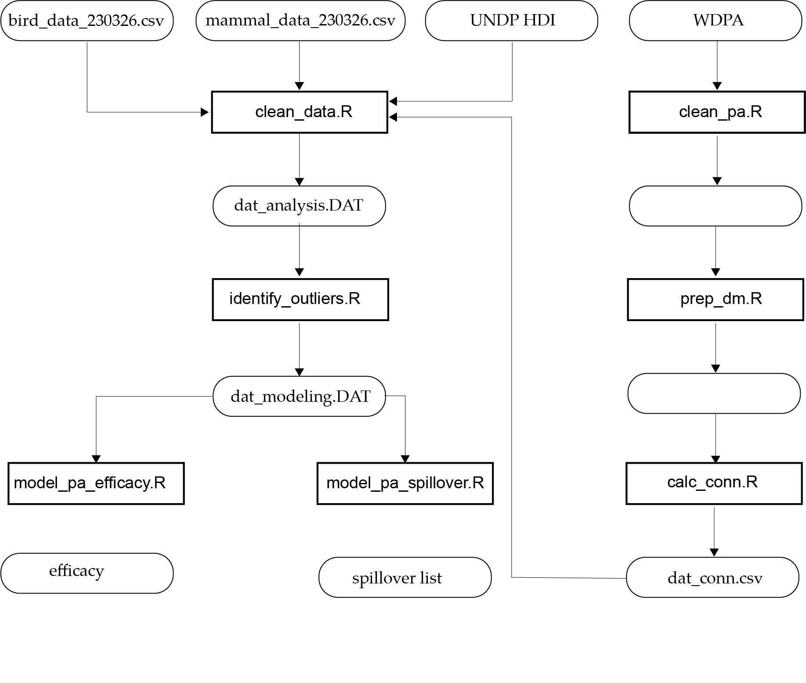

```{r chunk setup, include = FALSE, message = FALSE}
# Record packages
## Use conflicted to force all conflicts to become errors
packages <- c("here", "conflicted", "formatR", "groundhog", "kableExtra")

# load and install required packages
for (pkg in packages){
    if (!require(pkg, character.only = TRUE)) {
        install.packages(pkg)
        require(pkg, character.only = TRUE)
    }
}

# record the R processing environment
writeLines(
  capture.output(sessionInfo()),
  here("procedure", "environment", paste0("r-environment-", Sys.Date(), ".txt"))
)

# save package citations
knitr::write_bib(c(packages, "base"), file = here("software.bib"))

# set up default knitr parameters
# https://yihui.org/knitr/options/
knitr::opts_chunk$set(
  echo = FALSE, # Run code, show outputs (don't show code)
  eval = TRUE,
  fig.retina = 4,
  fig.height = 7.5,
  fig.width = 6.5,
  fig.path = paste0(here("results", "figures"), "/"),
  warning = FALSE,
  message = FALSE,
  tidy.opts = list(width.cutoff = 60),
  tidy = TRUE
)

# set working directory as the project folder
knitr::opts_knit$set(root.dir = here(''))
options(tinytex.verbose = TRUE)
```

# Introduction
This study is a *replication* of:

> Brodie, J.F., Mohd-Azlan, J., Chen, C. et al. Landscape-scale benefits of protected areas for tropical biodiversity. Nature 620, 807–812 (2023). [https://doi.org/10.1038/s41586-023-06410-z](https://doi.org/10.1038/s41586-023-06410-z)

Using a causal framework that controls for forest structure, site accessibility, and geographic location through matching, Brodie et al. (2023) find evidence that protected areas (PA) preserve vertebrate biodiversity within their boundaries and in the adjacent unprotected landscape. 
While Brodie et al. provide evidence of the efficacy of protected area status, they do not assess whether the effect they observe is altered by the connectedness of the protected area network.
PA connectivity is widely recognized as a component of effective conservation, a guiding principle of the 30x30 initiative, and a possible confound of the effect of protection on biodiversity. 
Ecologically, the connectedness of a PA network may affect biodiversity by facilitating gene flow across locations, which may moderate the effect of protection on biodiversity.

To adjust for effect of connectivity on PA efficacy, we computationally reproduced the findings of Brodie et al. using the data shared by the authors, and extended the original analysis by introducing habitat connectivity as an independent predictor of biodiversity and a moderator of the PA effect.
We find that ...

This document presents our replication and extension of Brodie et al. (2023). 
All data and materials needed to fully reproduce the results of this paper are publicly available in an Open Science Framework project repository with the identifier PROJECT DOI that links to GitHub (LINK)  and data and results stored on figshare (LINK) with the identifier DATA DOI.
This document is the produce of a computational notebook (RPL_Report.Rmd) available in that project repository. 
That computational notebook contains the code used to produce the results presented in this report. 
For brevity and legibility, we have suppressed some longer section of code here.
A computational reproduction of the authors' original analysis is also available in the project repository - *Reproduction Report for Brodie et al. (2023)*.

# Study design
We adopt the statistical approach of the original analysis and test the sensitivity of the authors' findings to PA connectivity. 
Using propensity score matching to control for the confounds of location, site accessibility, and forest structure, Brodie et al. fit a linear mixed-effects model to measure the effect of PA status on bird and mammal biodiversity.
The response variable examined in the study were three measures of biodiversity measured for both mammals and birds - Species richness (SR), Functional richness (FR), and Phylogenetic diversity (PD).
The response variables were derived from 1,079 sampling locations in the eBird database and 1,365 camera stations deployed across the region. 

The primary predictor of interest was binary measures indicating whether a observation site was located inside or outside a PA.
The primary predictors of interest for a secondary analysis of spillover and leakage effects in areas surrounding PAs were the size of the nearest PA and the distance to the nearest PA.
This secondary analysis was conducted only for observatio sites located outside PAs.
Primary predictors measuring PA status were derived from the World Database of Protected
Areas. 
Additional predictors used to deconfound for site accessibility, forest structure, understory density, and human development pressure were derived from the NASA Global Ecosystem Dynamics Investigation (GEDI) mission, and the UN Development program Human Development Index. Site accessibility was measured using circuit theory-based metrics of proximity to human development1. Forest structure and understory density were measured use three-dimensional metrics derived from GEDI mission.

We conduct two related analyses to evaluate and extend the work of the Brodie et al. (2023). 

First, we introduce PA connectivity as a predictor of bird and mammal biodiversity and a moderator of PA efficacy.
Brodie et al. find evidence that the legal designation of PAs enhances Southeast Asian bird biodiversity.
The authors did not find the same effect for mammals. 
Our primary hypotheses are:

> HA-1a: The protected area status of a site alters the level of mammal and bird biodiversity observed at that site when adjusting for the confounds of site accessibility, habitat condition, socioeconomic development, **and protected area connectivity**.

> HA-1b: How connected a site is to surrounding protected areas moderates the effect protected area status has on the level of mammal and bird biodiversity observed at that site when adjusting for the confounds of site accessibility, habitat condition, socioeconomic development.

Second, we examine whether the beneficial spillover effects observed around PAs persist when adjusting for PA connectivity.
Brodie et al. find evidence that large PAs are associated with higher biodiversities for mammals and birds in surrounding unprotected areas, but also that the effects for birds are smaller than those for mammals.
The authors found that distance to the nearest PA was significantly associated with only mammal biodiversity.
Our primary hypotheses are:

> HA-2a: The total area of the protected area located closest to an unprotected observation site alters the level of mammalian of avian biodiversity observed at that site when adjusting for the confounds of site accessibility, habitat condition, and the socioeconomic development, **and protected area connectivity**.

> HA-2b: The distance to the protected area located closest to an unprotected observation site
alters on the level of mammalian of avian biodiversity observed at that site when adjusting for the confounds of site accessibility, habitat condition, and the socioeconomic development, **and protected area connectivity**..

While Brodie et al. did not include measures of ecologically-focused landscape connectivity in their analyses, their work does in fact mirror our own interest in connectivity.
First, the authors recognize the importance of human-focused connectivity through their site accessibility measure.
Second, the analyses of spillovers performed in the study are essentially highly localized forms of connectivity analysis. 
Functionally, connectivity metrics are largely, if not entirely, determined by distance relationships and area sizes of land covers or land uses in a landscape. 
The specifications of the mixed effects models testing for spillover or leakage effects alternatively focus attention on the size an adjacent PA or the distance to an adjacent PAs. 
When the effect of the size of the adjacent PA is the focus, distance to that adjacent PA is controlled for. 
When the effect of distance to the adjacent PA is the focus, the size of that adjacent PA is controlled for. 
This approach reduces the ecological analysis of connectivity to the protected landscape adjacent to a site.
However, there are several reasons why connections to other protected areas might effect these local effects and the efficacy of PAs - motivating our extended analysis.

# Materials and Procedure

## Replication Workflow
This replication attempt builds on our computational reproduction of Brodie et al. (2023).
We use the same computational environments, data, and data preparation procedure adopted in that work. 
Complete details of the materials and methods used are available in *Reproduction Report for Brodie et al. (2023)* and can be evaluated in depth by examining the functions called throughout this document. 
Overall our workflow (Fig. 1) uses seven functions to prepare, process, and statistically analyze our data.
Additional functions used to create figures are called in our computational notebook and available in the project repository.



## Connectivity Measures
We measure site connectivity as the area-weighted flux (AWF) of species observation sites and the surrounding landscape. 
In this application, $AWF$ measures flow, weighted by PA area, between all observation sites as,

$$AWF = \sum_{j}^{n}\sum_{j,i \ne j}^{n} p_{ij} \cdot a_i \cdot a_j$$
$$p_{ij} = e^{- \theta \cdot  d_{ij}}$$
$$\theta = \frac{-\ln(0.5)}{d_{med}}$$

where 
$p_{ij}$ is the probability of dispersal between two sites $i$ and $j$, $a_i$ and $a_j$ are the areas of PAs $i$ and $j$, $d_{ij}$ is the observed distance between $i$ and $j$, and $d_{med}$ is a median dispersal distance at which $p_{ij} = 0.5$. 

To construct our site connectivity measures, we independently gathered data on PA geographies from the the World Database on Protected Areas ([https://www.protectedplanet.net/en/thematic-areas/wdpa?tab=WDPA](https://www.protectedplanet.net/en/thematic-areas/wdpa?tab=WDPA)). 
The WDPA dataset was pre-processed using several steps to ensure accuracy and relevance for the study. 
First, we used the `wdpa_fetch` and `wdpa_clean` functions from the R package `wdpar` to query and clean the data. 
This process excluded PAs that were not yet implemented or had limited conservation value, replaced missing data codes with NA values, converted point-based PAs into circular shapes that correspond to their reported extent, fixed topological errors, and removed overlapping areas 
Details about this procedures are available in the `wdpa_clean` function. 

Next, we restricted our analysis by subsetting to those terrestrial PAs located within the study area. 
We then merged administratively distinct, but physically connected PAs and segmented PAs that were part of the same administrative unit, but not physically connected. 
The dataset was then clipped to the coastline to retain only the terrestrial portions of the PAs
The areas for the reorganized PAs were recalculated. 
This created PAs that better matched real world conditions and provided more representative measures of PA size for spillover and connectivity analyses.

Finally, small residual areas (<0.01 km²) from the clipping process were removed. 
We then grouped PAs on the same contiguous landmass, under the assumption that mammals cannot cross locations disconnected by large water bodies.
Only PAs located on the same landmass were considered when calculating landscape connectivity for mammals to allow the analysis to reflect realistic movement limitations imposed by geographical barriers.

Once the PAs and their corresponding clusters were prepared, we began calculating the $AWF$ for observation sites. 
Calculation of $AWF$ depends on the specification of a median dispersal distance. 
To assess the effect of varying dispersal distances, we computed $AWF$ using a range of median dispersal distances between 10km and 150km. 
For each specified dispersal distance, we identified the PAs around each site and within a buffer set to five times the dispersal distance 
For mammals, only PAs in the same continent as the observation site were included. The Euclidean distances between the observation site and the selected PAs were then used to calculate the AWF for that site.

This procedure is implemented as:

```{r package setup, echo = FALSE, results = 'hide', message = FALSE, warning = FALSE}
# Run these lines secretly
source(here("procedure/code/kick_off.R"))
# Load required packages and scripts
kick_off('procedure/code')
```

```{r calculate_conn, eval=FALSE, echo=TRUE, results='hide', message=FALSE}
source(here("procedure/code/kick_off.R"))
# Load required packages and scripts
kick_off('procedure/code')

# Calculate site connectivity for birds and mammals
calc_conn(taxon = "bird", src_dir = src_dir, dst_dir = dst_dir)
calc_conn(taxon = "mammal", src_dir = src_dir, dst_dir = dst_dir)
```

## Preparation of the Analytical Data Files

Preparation of our analytical data file followed the procedures outlined in Brodie et al. (2023) and implemented in our computational reproduction. 
Because Brodie et al. did not directly analyze landscape connectivity, we appended our calculated connectivity measures to the authors' original datafile and scaled those variables following the procedures used for other predictors.

```{r clean_data, echo=TRUE, results='hide', message=FALSE}
# Clean data for statistical analysis
conn_metrics <- 'awf_ptg'
src_dir <- "data/raw/public"
conn_dir <- "data/derived/public"
dst_dir <- "data/derived/public"
dat_clean_bird <- clean_data("bird", conn_metrics, src_dir, conn_dir, dst_dir)
dat_clean_mammal <- clean_data("mammal", conn_metrics, src_dir, conn_dir, dst_dir)
```

# Statistical Results

## Implementation of the Linear Mixed Effects Model of PA Efficacy
We first use propensity score matching and a linear mixed effects model to assess whether the finding that PA preserve vertebrate biodiversity within their boundaries persisted when adjusting for connectivity (**HA-1a**) and whether connectivity moderates any PA effects (**HA-1b**).
Here we report connectivity results using a 100km threshold.
Sensitivity analyses for alternative threshold are included in section 6.

```{r rpl_eff, echo=TRUE, results='hide', message=FALSE}
# Make a common catalog
var_catalog <- data.frame(
    response_variable = c("asymptPD", "maxFRic", "SR.mean"), 
    name = c("PD", "FR", "SR"))

# Reproduce models for birds
dat_clean_bird <- subset(dat_clean_bird, med_dist == 100)

rpl_efficacy_bird <- lapply(1:nrow(var_catalog), function(i){
    model_pa_efficacy(dat_clean_bird, "connec", "bird",
                      var_catalog[[i, "response_variable"]], "auto") 
}); names(rpl_efficacy_bird) <- sprintf("mod_bird_eff_%s", var_catalog$name)

# Reproduce models for mammals
dat_clean_mammal <- subset(dat_clean_mammal, med_dist == 50)

rpl_efficacy_mammal <- lapply(1:nrow(var_catalog), function(i){
    model_pa_efficacy(dat_clean_mammal, "connec", "mammal",
                      var_catalog[[i, "response_variable"]], "auto")
}); names(rpl_efficacy_mammal) <- sprintf("mod_mammal_eff_%s", var_catalog$name)
```

## Implementation of the Linear Mixed Effects Models of PA Spillovers
We use propensity score matching and a linear mixed effects model to assess whether The the spillover effects of the total area of the nearest PA (**HA-2a**) or distance to the nearest PA (**HA-2b**) persist when accounting for PA connectivity to the larger PA network.
It is worth noting that although the text and data file of the original article identify PA size and PA distance as continuous measures, they are in fact converted to binary indicators in the authors' code file. 
Accordingly, we match this procedure and use the same threshold values applied in the binary conversion by Brodie et al. 
For these specifications, we again report connectivity results using a 100km threshold.
Sensitivity analyses for alternative threshold are included in section 6.

```{r rpl_spill, echo=TRUE, results='hide', message=FALSE}
# Replicate spillover models for birds w/ connectivity
rpl_spill_bird <- lapply(1:nrow(var_catalog), function(i){
    mods <- lapply(c("BigPA", "CloseToPA"), function(bnr_var){
        model_pa_spillover(dat_clean_bird, "connec+", "bird", bnr_var, 
                       var_catalog[[i, "response_variable"]], "auto")
    })
    names(mods) <- sprintf("mod_bird_%s_%s", c("size", "dist"), 
                           var_catalog[[i, "name"]])
    mods
}); rpl_spill_bird <- do.call(c, rpl_spill_bird)

# Replicate spillover models for mammals w/ connectivity
rpl_spill_mammal <- lapply(1:nrow(var_catalog), function(i){
    mods <- lapply(c("BigPA", "CloseToPA"), function(bnr_var){
        model_pa_spillover(dat_clean_mammal, "connec+", "mammal", bnr_var, 
                       var_catalog[[i, "response_variable"]], "auto")
    })
    names(mods) <- sprintf("mod_mammal_%s_%s", c("size", "dist"), 
                           var_catalog[[i, "name"]])
    mods
}); rpl_spill_mammal <- do.call(c, rpl_spill_mammal)

# Concatenate the model results
mods <- list("bird" = do.call(c, list(rpl_efficacy_bird, rpl_spill_bird)), 
             "mammal" = do.call(c, list(rpl_efficacy_mammal, rpl_spill_mammal)))
```

## Statistical Results of the Replication Attempts
```{r rpl_spill_tab, echo = FALSE, message = FALSE, warning = FALSE}
# Insert code to construct a summary table of efficacy models like Table 1 in Brodie et al.
# Define variable convert table
var_cvt <- data.frame(
    term = c("R2", "(Intercept)", "forest_structure", "access_log10.z", 
             "HDI.z", "PA", "connectivity.z", "PA:connectivity.z",
             "dist_to_PA.z", "BigPA", "BigPA:connectivity.z",
             "PA_size_km2.z", "CloseToPA", "CloseToPA:connectivity.z"),
    Variable = c("$R^{2}$", "(Intercept)", "Forest canopy height",
                 "Site accessibility", "HDI", "PA", "Connectivity",
                 "PA|Connectivity", "Distance to PA", "PA size (binary)",
                 "PA size|Connectivity", "PA size", 
                 "Distance to PA (binary)", "Distance to PA|Connectivity"))

coefs <- lapply(names(mods), function(taxon){
    models <- mods[[taxon]]
    lapply(names(models), function(nm){
        
        # Extract names for identity
        var_nm <- toupper(strsplit(nm, "_")[[1]][4])
        effect_nm <- strsplit(nm, "_")[[1]][3]
        effect_nm <- ifelse(
            effect_nm == "eff", "All sites",
            ifelse(effect_nm == 'size', 
                   "Outside protected areas - 'PA size' effect",
                   "Outside protected areas - 'Distance to PA' effect"))
        r_square <- r.squaredGLMM(models[[nm]])[[2]]
        
        # Do the tidy work
        broom.mixed::tidy(
            models[[nm]], effects='fixed', conf.int = TRUE) %>% 
            mutate(report_value = sprintf("%.3f\n(%.3f; %.3f)", 
                                          estimate, std.error, p.value)) %>% 
            select(term, report_value) %>% 
            rbind(c("R2", sprintf("%.3f", r_square)), .) %>% 
            left_join(var_cvt, by = "term") %>% 
            mutate(var_nm = var_nm, Effect = effect_nm) %>% 
            select(Effect, Variable, report_value, var_nm)
    }) %>% bind_rows() %>% 
        mutate(var_nm = factor(var_nm, levels = c("SR", "FR", "PD"))) %>% 
        arrange(var_nm) %>% 
        pivot_wider(names_from = var_nm, values_from = report_value)
})
coefs <- left_join(coefs[[1]], coefs[[2]], by = c("Variable", "Effect"),
                       suffix = sprintf(".%s", c("Birds", "Mammals")))

# Manipulate the table
effects <- unique(coefs$Effect)
row_1 <- which(coefs$Effect == effects[1])
row_2 <- which(coefs$Effect == effects[2])
row_3 <- which(coefs$Effect == effects[3])
coefs <- coefs %>% select(-Effect) %>% 
    mutate_all(linebreak)

# Bold some cells
row_ids <- which(coefs$Variable %in% 
                     c("PA", "Connectivity",
                       "PA|Connectivity", "PA size (binary)",
                       "PA size|Connectivity", "Distance to PA (binary)",
                       "Distance to PA|Connectivity"))
detec_sig <- coefs[row_ids, -1]
detec_sig <- do.call(cbind, lapply(1:ncol(detec_sig), function(i){
    as.numeric(sapply(detec_sig[[i]], function(x){
        str_extract(x, "(?<=;[[:space:]]).*?(?=\\))")}))
}))
detec_sig <- detec_sig <= 0.05
bold_ids <- matrix(data = FALSE, nrow = nrow(coefs), ncol = ncol(coefs))
bold_ids[row_ids, 1:ncol(detec_sig) + 1] <- detec_sig

for (i in 1:nrow(bold_ids)){
    for (j in 1:ncol(bold_ids)){
        if (bold_ids[i, j] == TRUE){
            coefs[i, j] <- cell_spec(coefs[i, j], bold = T, escape = FALSE)
        }
    }
}

# Make the kable
names(coefs) <- c("Variable", "SR", "FR", "PD", "SR", "FR", "PD")
cap <- paste0("Results from mixed-effects linear regression for ",
              "species richness (SR), functional richness (FR), ",
              "and phylogenetic diversity (PD). Following Brodie et al., 
              bolding indicates predictors with estimated coefficients with 
              p<0.05")
coefs %>%
    kableExtra::kbl(escape = FALSE, full_width = FALSE, booktabs = TRUE,
                    caption = cap) %>% 
    kable_paper() %>% 
    kable_styling(latex_options = c("scale_down", "hold_position"), 
                  font_size = 10) %>% 
    pack_rows(effects[1], min(row_1), max(row_1), latex_gap_space = "1em") %>%
    pack_rows(effects[2], min(row_2), max(row_2), latex_gap_space = "1em") %>% 
    pack_rows(effects[3], min(row_3), max(row_3), latex_gap_space = "1em") %>% 
    add_header_above(c(" " = 1, "Bird" = 3, "Mammal" = 3),
                     align = "c")
```

Overall, the statistical results of our replication (Table 1) were generally similar to those produced in the original analyses of Brodie et al. (Table 2).
Focusing on the primary predictors of interest for the all sites PA efficacy model, our analysis preserved the direction of the originally estimated PA effects for both birds and mammals. 
However, we also observed shifts in the estimated magnitude of the PA effect for the bird models and a change in the statistical significance of the PA effect for bird models estimated with SR and FR. 
Specifically, the estimated magnitude of the PA effect for the SR model dropped to 28 percent of the originally estimated value, while the same effect estimate in the FR model dropped to 66 percent of the originally estimated value. 
These new estimates were also not statistically significant at the p=0.05 level the original authors used to interpret their results.

Connectivity was not a consistent predictor of bird biodiversty across the three response variables. 
The estimated coefficients were negative and non-signficant for SD, negative and significant for FR, and positive and significant for PD. 
Estimated coefficients of the interaction of PA status and connectivity also had different directions for different response variables, but all were non-significant. 
Neither PA effects, connectivity, nor the PA-connectivity interaction were statistically significant for any of the mammal models.
This final result is consistent with Brodie et al., who similarly found non-significant PA effects for mammals.

The magnitude of the estimate of PA size effect in the FR model for birds is less than one-half the size of the effect estimated by Brodie et al.  

```{r compare_eff, echo = FALSE, message = FALSE, warning = FALSE}
compare_eff <- data.frame(
    Change = c("Direction", "Magnitude", "Significance"),
    SR = c("$\\equiv$", "$\\downarrow$", "s $\\rightarrow$ ns"),
    FR = c("$\\equiv$", "$\\downarrow$", "s $\\rightarrow$ ns"),
    PD = c("$\\equiv$", "$\\downarrow$", "$\\equiv$ s")) %>% 
    cbind(data.frame(
        SR = c("$\\equiv$", "$\\uparrow$", "$\\equiv$ ns"),
        FR = c("$\\equiv$", "$\\uparrow$", "$\\equiv$ ns"),
        PD = c("$\\equiv$", "$\\downarrow$", "$\\equiv$ ns")))
```

```{r compare_spl, echo = FALSE, message = FALSE, warning = FALSE}
compare_spl <- data.frame(
    Change = c("Direction", "Magnitude", "Significance"),
    SR = c("$\\equiv$", "$\\downarrow$", "$\\equiv$ ns"),
    FR = c("$\\equiv$", "$\\downarrow$", "s $\\rightarrow$ ns"),
    PD = c("$\\equiv$", "$\\uparrow$", "$\\equiv$ s")) %>% 
    cbind(data.frame(
        SR = c("$\\equiv$", "$\\uparrow$", "s $\\rightarrow$ ns"),
        FR = c("$\\equiv$", "$\\downarrow$", "$\\equiv$ s"),
        PD = c("$\\equiv$", "$\\downarrow$", "s $\\rightarrow$ ns"))) %>% 
    rbind(data.frame(
        Change = c("Direction", "Magnitude", "Significance"),
        SR = c("$\\equiv$", "$\\uparrow$", "$\\equiv$ s"),
        FR = c("$\\equiv$", "$\\uparrow$", "ns $\\rightarrow$ s"),
        PD = c("$\\equiv$", "$\\downarrow$", "$\\equiv$ ns")) %>% 
            cbind(data.frame(
                SR = c("$\\equiv$", "$\\uparrow$", "ns $\\rightarrow$ s"),
                FR = c("$\\equiv$", "$\\downarrow$", "$\\equiv$ ns"),
                PD = c("$\\equiv$", "$\\downarrow$", "$\\equiv$ ns"))))

rbind(compare_eff, compare_spl) %>%
    kableExtra::kbl(escape = FALSE, full_width = FALSE, booktabs = TRUE,
                    caption = "Comparison of PA efficacy and spillover") %>% 
    kable_paper() %>% 
    kable_styling(latex_options = c("scale_down", "hold_position"), 
                  font_size = 10) %>% 
    pack_rows(effects[1], 1, 3, latex_gap_space = "1em") %>%
    pack_rows(effects[2], 4, 6, latex_gap_space = "1em") %>% 
    pack_rows(effects[3], 7, 9, latex_gap_space = "1em") %>% 
    add_header_above(c(" " = 1, "Bird" = 3, "Mammal" = 3),
                     align = "c") %>% 
    footnote(general = paste0(
        "s is for statistically significant, ",
        "and ns is for not statistically significant. ",
        "$\\\\equiv$ indicates the same, $\\\\downarrow$ is ",
        "for decrease, and $\\\\uparrow$ is for increase."),
        escape = FALSE, threeparttable = TRUE)
```

# Discussion

- PA size statistics. What is the difference in the mean PA sizes between brodie and our combined PAs? Std? Could this link with the PA size effects?

# Sensitivity Analyses

Compile models runs all the functions above and produces x...

```{r compile_models, echo = TRUE, message = FALSE, warning = FALSE, eval = FALSE}
for (dist in seq(10, 150, 10)){
    compile_models(taxon = "bird", med_dist = dist,
                   src_dir = "data/derived/public", 
                   dst_dir = "results")
    compile_models(taxon = "mammal", med_dist = dist,
                   src_dir = "data/derived/public", 
                   dst_dir = "results")
}

# Generate plots
plot_dist_effect(src_dir = "results", dst_dir = "results/figures")
```

```{r, bird_eff_dist, echo = FALSE, message = FALSE, warning = FALSE, eval = TRUE}
load(here("results/figures/plot_dist_effect_taxons.rda"))

# Birds 3x3 efficacy result over distance
taxon_dist_plot$bird$`Phylogenetic diveristy (PD)` +
    ggtitle(paste0("Bird", " - ", "Phylogenetic diveristy (PD)")) +
    theme(plot.title = element_text(hjust = 0.5))
taxon_dist_plot$bird$`Functional richness (FR)` +
    ggtitle(paste0("Bird", " - ", "Functional richness (FR)")) +
    theme(plot.title = element_text(hjust = 0.5))
taxon_dist_plot$bird$`Species richness (SR)` +
    ggtitle(paste0("Bird", " - ", "Species richness (SR)")) +
    theme(plot.title = element_text(hjust = 0.5))
```

```{r, mammal_eff_dist, echo = FALSE, message = FALSE, warning = FALSE, eval = TRUE}
# Mammals 3x3 efficacy result over distance
taxon_dist_plot$mammal$`Phylogenetic diveristy (PD)` +
    ggtitle(paste0("Mammal", " - ", "Phylogenetic diveristy (PD)")) +
    theme(plot.title = element_text(hjust = 0.5))
taxon_dist_plot$mammal$`Functional richness (FR)` +
    ggtitle(paste0("Mammal", " - ", "Functional richness (FR)")) +
    theme(plot.title = element_text(hjust = 0.5))
taxon_dist_plot$mammal$`Species richness (SR)` +
    ggtitle(paste0("Mammal", " - ", "Species richness (SR)")) +
    theme(plot.title = element_text(hjust = 0.5))
```
